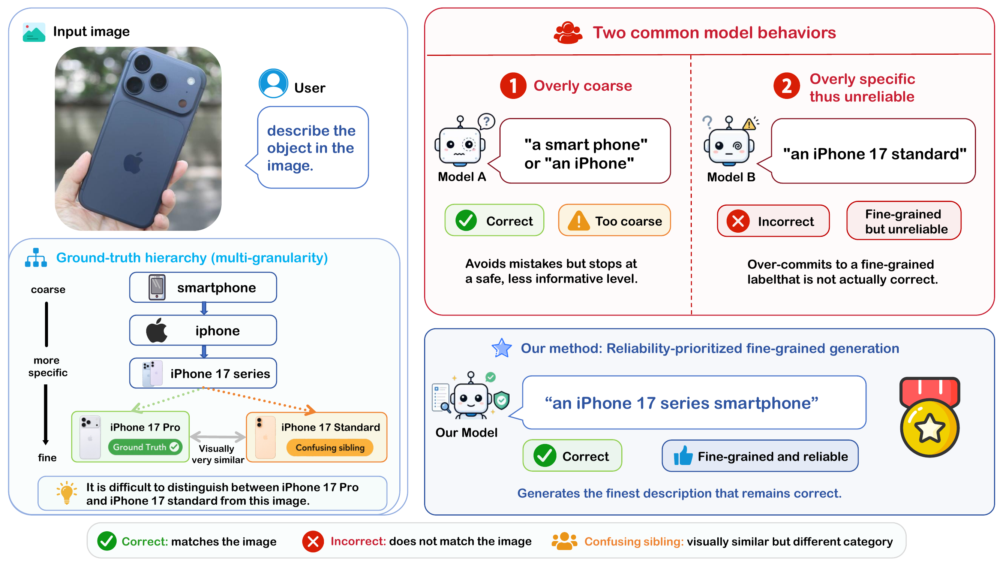

# GranFact

Official code for **Reliability-Prioritized Fine-Grained Generation in Multimodal Large Language Models**.

GranFact evaluates whether multimodal large language models can generate image descriptions that are both **reliable** and **fine-grained**. The code supports answer generation, response extraction, category/attribute matching, and final metric computation.

<p align="center">
  
</p>

## What this code does

This repository provides the evaluation pipeline for GranFact.

The pipeline has three stages:

1. **Stage 1: Answer generation**  
   Run an MLLM on GranFact images and save open-ended responses.

2. **Stage 2: Extraction and matching**  
   Parse model responses into structured prediction entities, match them to GT entities, judge category/attribute consistency, and solve the final assignment.

3. **Stage 3: Evaluation**  
   Compute reliability metrics and granularity-aware metrics.

The full pipeline can be launched with:

```bash
scripts/benchmark-cli.sh
```

## Environment

We recommend using Python 3.10.

```bash
conda create -n granfact python=3.10 -y
conda activate granfact
pip install -r requirements.txt
```

## Dataset
The evaluation dataset of our benchmark can be downloaded at https://huggingface.co/datasets/WeiWu2026/GranFact.

Please place the GranFact dataset under a directory such as:

```text
/path/to/GranFact/
```

The code recursively scans the dataset root for annotation `.json` files. Each sample should contain an image path and structured GT annotations.

## How to run

Use the CLI wrapper to run the pipeline.

```bash
bash scripts/benchmark-cli.sh \
  --dataset-root /path/to/GranFact \
  --output-root ./model_outputs \
  --model-to-evaluate qwen3-vl-8b \
  --model-to-evaluate-ckpt /path/to/qwen3-vl-8b \
  --judge-model qwen3.5-27b \
  --judge-ckpt /path/to/qwen3.5-27b \
  --prompt-style aggressive \
  --stage1-gpus 0,1,2,3 \
  --stage1-vllm-tp 4 \
  --stage2-gpus 0,1,2,3 \
  --stage2-vllm-tp 4
```

### Key arguments

| Argument | Description |
|---|---|
| `--dataset-root` | Path to the GranFact dataset root. |
| `--output-root` | Directory for all generated outputs. |
| `--model-to-evaluate` | A short name for the evaluated MLLM. It is used in the output path. |
| `--model-to-evaluate-ckpt` | Local path or Hugging Face path of the evaluated MLLM. Required for local Stage 1. |
| `--judge-model` | A short name for the LLM judge used in Stage 2. |
| `--judge-ckpt` | Local path or Hugging Face path of the LLM judge. |
| `--prompt-style` | Prompt style for Stage 1. Choices: `aggressive`, `neutral`, `conservative`. |
| `--start-stage` / `--end-stage` | Run a subset of the pipeline. Choices: `1`, `2`, `3` or `stage1`, `stage2`, `stage3`. |
| `--stage1-backend` | Stage-1 answer generation backend. Choices: `local`, `api`. |
| `--stage1-gpus`, `--stage2-gpus` | GPU ids used by Stage 1 and Stage 2. |
| `--stage1-vllm-tp`, `--stage2-vllm-tp` | vLLM tensor parallel size for Stage 1 and Stage 2. |
| `--stage1-run-id`, `--stage2-run-id`, `--stage3-run-id` | Optional run ids. Useful for resuming or comparing different runs. |

To run only Stage 2 and Stage 3 from existing Stage-1 outputs:

```bash
bash scripts/benchmark-cli.sh \
  --dataset-root /path/to/GranFact \
  --output-root ./model_outputs \
  --model-to-evaluate qwen3-vl-8b \
  --judge-model qwen3.5-27b \
  --judge-ckpt /path/to/qwen3.5-27b \
  --stage1-run-id stage1-aggressive-max2048 \
  --start-stage 2 \
  --end-stage 3
```

For API-based Stage 1, use:

```bash
export OPENAI_API_KEY=your_api_key

bash scripts/benchmark-cli.sh \
  --dataset-root /path/to/GranFact \
  --output-root ./model_outputs \
  --stage1-backend api \
  --model-to-evaluate gpt-5.4 \
  --api-model gpt-5.4 \
  --api-base-url https://your.openai-compatible.endpoint/v1 \
  --api-key-env-name OPENAI_API_KEY \
  --judge-model qwen3.5-27b \
  --judge-ckpt /path/to/qwen3.5-27b \
  --prompt-style aggressive
```

## Output

The main outputs are saved under:

```text
model_outputs/
└── <model_name>/
    └── stage1_answers-<stage1_run_id>/
        ├── stage1_outputs/
        │   └── results.jsonl
        └── stage2-ext_match/
            └── <stage2_run_id>/
                ├── per_sample.jsonl
                └── stage3_eval/
                    └── <stage3_run_id>/
                        ├── global_metrics.json
                        ├── domain_metrics.csv
                        └── sample_metrics.csv
```

## Main results

Performance on GranFact under different prompt styles.

<table>
  <thead>
    <tr>
      <th rowspan="2">Model</th>
      <th rowspan="2">Prompt Style</th>
      <th colspan="4">Granularity-neutral Metrics</th>
      <th colspan="5">Granularity-aware Metrics</th>
    </tr>
    <tr>
      <th>IR</th>
      <th>P</th>
      <th>R</th>
      <th>F1</th>
      <th>GIR</th>
      <th>P<sub>gran</sub></th>
      <th>R<sub>gran</sub></th>
      <th>F1<sub>gran</sub></th>
      <th>G<sub>avg</sub></th>
    </tr>
  </thead>
  <tbody>
    <tr><td colspan="11"><em>Comparable-Scale Open-Weight Models</em></td></tr>
    <tr>
      <td rowspan="3">InstructBLIP-Vicuna-7B</td>
      <td>Aggressive</td><td>0.1962</td><td>0.3897</td><td>0.3079</td><td>0.3440</td><td>0.0904</td><td>0.1627</td><td>0.1286</td><td>0.1437</td><td>0.4176</td>
    </tr>
    <tr>
      <td>Neutral</td><td>0.3959</td><td>0.6125</td><td>0.2397</td><td>0.3446</td><td>0.1352</td><td>0.2192</td><td>0.0858</td><td>0.1233</td><td>0.3578</td>
    </tr>
    <tr>
      <td>Conservative</td><td>0.3890</td><td>0.6211</td><td>0.2330</td><td>0.3388</td><td>0.1323</td><td>0.2281</td><td>0.0855</td><td>0.1244</td><td>0.3672</td>
    </tr>
    <tr>
      <td rowspan="3">InternVL3.5-8B</td>
      <td>Aggressive</td><td>0.3133</td><td>0.4817</td><td>0.5595</td><td>0.5177</td><td>0.1632</td><td>0.2421</td><td>0.2812</td><td>0.2602</td><td>0.5026</td>
    </tr>
    <tr>
      <td>Neutral</td><td>0.3873</td><td>0.6246</td><td>0.5257</td><td>0.5709</td><td>0.1919</td><td>0.3035</td><td>0.2554</td><td>0.2774</td><td>0.4858</td>
    </tr>
    <tr>
      <td>Conservative</td><td>0.4062</td><td>0.6330</td><td>0.5574</td><td>0.5928</td><td>0.1816</td><td>0.2894</td><td>0.2548</td><td>0.2710</td><td>0.4571</td>
    </tr>
    <tr>
      <td rowspan="3">Qwen2.5-VL-7B</td>
      <td>Aggressive</td><td>0.3838</td><td>0.6258</td><td>0.5551</td><td>0.5883</td><td>0.2126</td><td>0.3416</td><td>0.3029</td><td>0.3211</td><td>0.5458</td>
    </tr>
    <tr>
      <td>Neutral</td><td>0.4923</td><td>0.6699</td><td>0.5130</td><td>0.5811</td><td>0.2624</td><td>0.3529</td><td>0.2702</td><td>0.3061</td><td>0.5268</td>
    </tr>
    <tr>
      <td>Conservative</td><td>0.4647</td><td>0.6701</td><td>0.5130</td><td>0.5811</td><td>0.2229</td><td>0.3229</td><td>0.2472</td><td>0.2800</td><td>0.4819</td>
    </tr>
    <tr>
      <td rowspan="3">Qwen3-VL-8B-Instruct</td>
      <td>Aggressive</td><td>0.3718</td><td>0.6591</td><td>0.6469</td><td>0.6529</td><td>0.2450</td><td>0.3981</td><td>0.3907</td><td>0.3944</td><td>0.6040</td>
    </tr>
    <tr>
      <td>Neutral</td><td>0.4251</td><td>0.6865</td><td>0.6130</td><td>0.6477</td><td>0.2635</td><td>0.4047</td><td>0.3613</td><td>0.3818</td><td>0.5895</td>
    </tr>
    <tr>
      <td>Conservative</td><td>0.4664</td><td>0.7198</td><td>0.6511</td><td>0.6838</td><td>0.2573</td><td>0.3857</td><td>0.3488</td><td>0.3663</td><td>0.5358</td>
    </tr>
    <tr>
      <td rowspan="3"><strong>Ours (Qwen3-VL-8B)</strong></td>
      <td>Aggressive</td><td>0.4017</td><td>0.6719</td><td>0.6480</td><td>0.6597</td><td>0.2655</td><td>0.4183</td><td><strong>0.4034</strong></td><td><strong>0.4107</strong></td><td><strong>0.6225</strong></td>
    </tr>
    <tr>
      <td>Neutral</td><td>0.4897</td><td>0.7027</td><td>0.6163</td><td>0.6567</td><td><strong>0.2938</strong></td><td><strong>0.4217</strong></td><td>0.3698</td><td>0.3941</td><td>0.6001</td>
    </tr>
    <tr>
      <td>Conservative</td><td><strong>0.4940</strong></td><td><strong>0.7242</strong></td><td><strong>0.6514</strong></td><td><strong>0.6859</strong></td><td>0.2742</td><td>0.3935</td><td>0.3539</td><td>0.3726</td><td>0.5433</td>
    </tr>
    <tr><td colspan="11"><em>Frontier / Large-Scale Reference Models</em></td></tr>
    <tr>
      <td rowspan="3">Kimi-K2.6</td>
      <td>Aggressive</td><td>0.4527</td><td>0.6682</td><td>0.5337</td><td>0.5934</td><td>0.2202</td><td>0.4166</td><td>0.3328</td><td>0.3700</td><td><strong>0.6235</strong></td>
    </tr>
    <tr>
      <td>Neutral</td><td>0.4647</td><td>0.6844</td><td>0.4954</td><td>0.5747</td><td>0.2332</td><td>0.4193</td><td>0.3035</td><td>0.3521</td><td>0.6127</td>
    </tr>
    <tr>
      <td>Conservative</td><td>0.4923</td><td>0.7126</td><td>0.5357</td><td>0.6116</td><td>0.2105</td><td>0.3786</td><td>0.2846</td><td>0.3249</td><td>0.5313</td>
    </tr>
    <tr>
      <td rowspan="3">GLM-4.6V</td>
      <td>Aggressive</td><td>0.4057</td><td>0.6751</td><td>0.7075</td><td>0.6910</td><td>0.2533</td><td>0.3881</td><td>0.4067</td><td>0.3972</td><td>0.5748</td>
    </tr>
    <tr>
      <td>Neutral</td><td>0.4603</td><td>0.7093</td><td>0.6671</td><td>0.6876</td><td>0.2717</td><td>0.3881</td><td>0.3649</td><td>0.3762</td><td>0.5471</td>
    </tr>
    <tr>
      <td>Conservative</td><td>0.4922</td><td>0.7530</td><td>0.7128</td><td>0.7323</td><td>0.2654</td><td>0.3803</td><td>0.3600</td><td>0.3699</td><td>0.5051</td>
    </tr>
    <tr>
      <td rowspan="3">GPT-5.4</td>
      <td>Aggressive</td><td>0.2754</td><td>0.5894</td><td>0.7008</td><td>0.6403</td><td>0.1684</td><td>0.3478</td><td>0.4136</td><td>0.3779</td><td>0.5901</td>
    </tr>
    <tr>
      <td>Neutral</td><td>0.4983</td><td>0.7467</td><td>0.6318</td><td>0.6845</td><td>0.2752</td><td>0.3936</td><td>0.3331</td><td>0.3608</td><td>0.5271</td>
    </tr>
    <tr>
      <td>Conservative</td><td>0.4879</td><td>0.7612</td><td>0.6777</td><td>0.7170</td><td>0.2369</td><td>0.3616</td><td>0.3219</td><td>0.3406</td><td>0.4750</td>
    </tr>
    <tr>
      <td rowspan="3">Gemini-3.1-Flash-Lite</td>
      <td>Aggressive</td><td>0.4672</td><td>0.7510</td><td>0.7292</td><td>0.7400</td><td>0.3096</td><td>0.4595</td><td><strong>0.4461</strong></td><td><strong>0.4527</strong></td><td>0.6118</td>
    </tr>
    <tr>
      <td>Neutral</td><td>0.4836</td><td>0.7571</td><td>0.7019</td><td>0.7284</td><td><strong>0.3141</strong></td><td><strong>0.4622</strong></td><td>0.4285</td><td>0.4447</td><td>0.6105</td>
    </tr>
    <tr>
      <td>Conservative</td><td><strong>0.5112</strong></td><td><strong>0.7722</strong></td><td><strong>0.7424</strong></td><td><strong>0.7570</strong></td><td>0.3019</td><td>0.4265</td><td>0.4101</td><td>0.4182</td><td>0.5524</td>
    </tr>
  </tbody>
</table>

## Citation

TODO